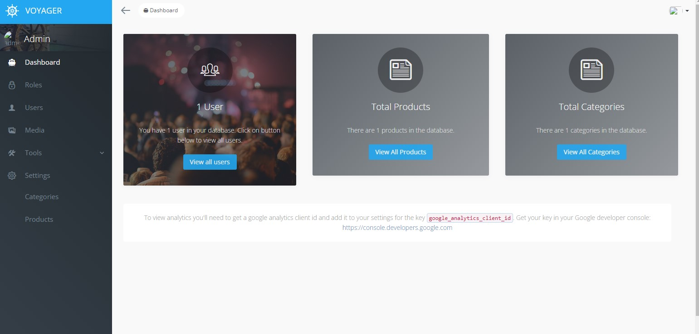
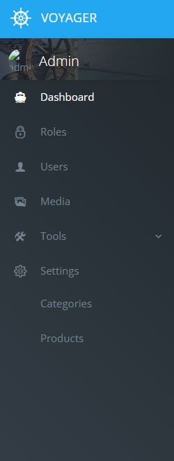
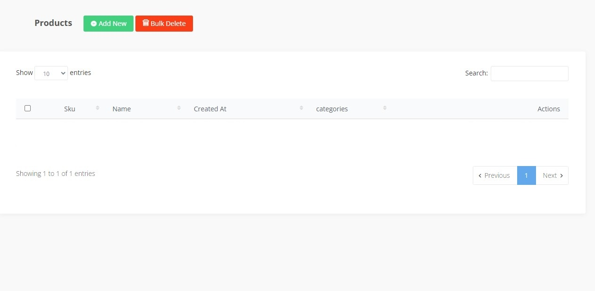
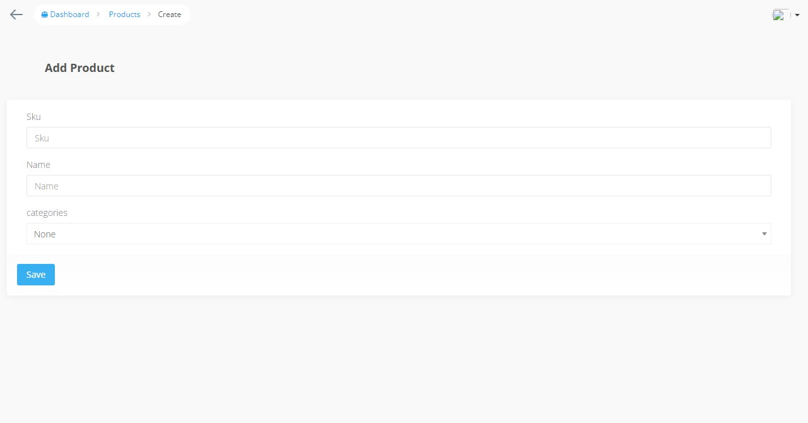
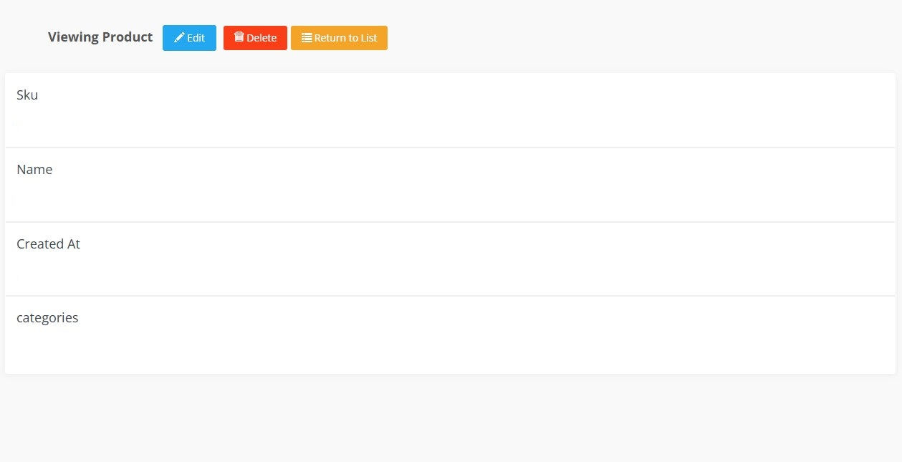
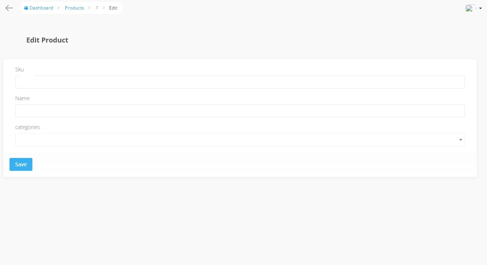
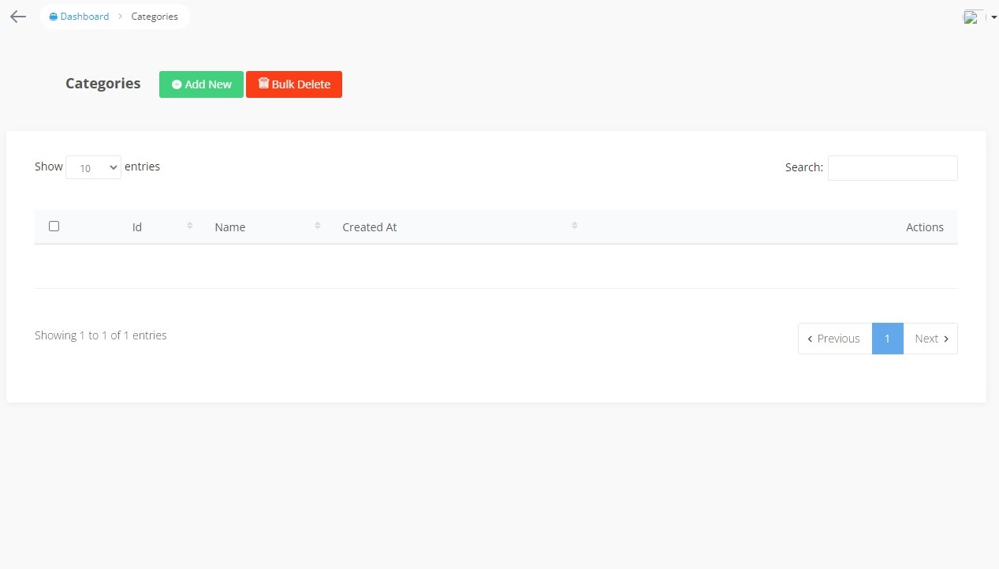

# Продвинутое программирование на PHP — Laravel

## Урок 14. Создание администраторской панели (Промежуточная аттестация)

### Цели практической работы:

— Научиться интегрировать админ-панель в проект.

  дашборда администратора с виджетами,
  левого меню панели администратора с новыми пунктами (категории и продукты),

раздела продуктов,

страницы создания продукта,

страницы просмотра одного продукта,

страницы редактирования продукта,

 раздела категорий.

— Разобраться в настройке CRUD-методов для сущности в voyager.

